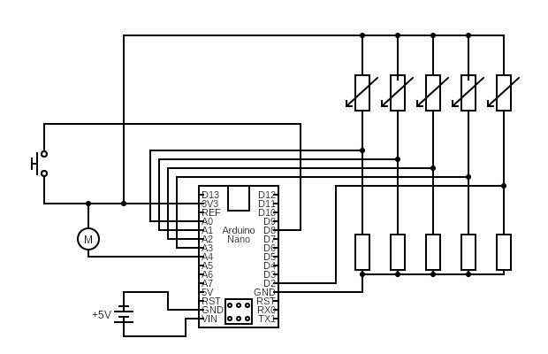

# PAWBOARD

https://github.com/lilygorsheneva/paw-board

A chorded keyboard using pressure sensitive resistors and bluetooth. Embedded software isn't my usual work but I thought this would be fun. 

## Features (Complete)

* Upper and lower-case english letter entry along with a few control characters; sufficient for chatting but not much more. 

* Wireless connectivity with passkey entry for MITM protection. 
> Note: The bluetooth functionality depends heavily on Expressif's example code, and I cannot vouch for the security of it or the BT libraries themselves. Device not recommended for a secure context.

* Haptic feedback.

## Features (planned)

* Layout switching (numerical input is actually supported right now but is only used during passkey entry).

* Automatic calibration (studying digital signal processing so I can get rid of the pushbutton).

## Hardware 

* Arduino Nano ESP32 (I tried other Arduinos but they don't support simultaneously using both Wireless functionality and all their ADC pins).

* Force sensing resistors
    * currently using DIY ones I made out of Velostat (an antistatic material whose resistivity is pressure-sensitive; easily obtained from diy electronics suppliers e.g. Adafruit)
    * I've tried [these](https://www.digikey.com/en/products/detail/ohmite/FSR05BE/10127621) force sensing resistors made by Ohmite but found mounting them and properly aligning them with my fingertips to be tricky. 

* Vibrator motor (for feedback).

### On extra buttons

I am currently working on adding modifier keys (e.g. shift, ctrl, a way to swap to numerical or symbolic layouts) but this may require a second hand's worth of sensors and making a new circuit board to support that (current board is out of room for resistors). I tried adding some capacitive touch sensors to the outside of the box above, but they seem to interfere with each other.

### DIY Velostat pressure sensors

Notes on Velostat, vaguely in order of importance:

* A very fast and somewhat decent sensor design:
    * Strip a small (1cm) section of two pieces of stranded wire
    * Tape a wire onto each side of a piece of velostat
        * Fan out or spread the wire to cover more surface area
    * This design is a bit bend-sensitive, bending will make areas of wire that are not normally in contact with the velostat make contact and produce a signal
    * Tape onto a glove fingertip
        * Attaching to the inside is tempting, but messy
        * Taping too tightly is uncomfortable, may not fit other people except the maker, and will lead to sweaty fingers
        * Sewing the sensor instead of taping is not recommended
            * VERY comfortable
            * time consuming
            * may short-circuit

* I've tried conductive fabric tape ([example from adafruit](https://www.adafruit.com/product/3961)) but the adhesive has trouble making an electrical connection to the velostat 
    * Fragments of stranded wire or other tiny metal particles improve contact but are far too messy for me to recommend
    * I have not tried copper tape yet

### On capacitive sensors

* Capacitive touch sensors are NOT useful as a primary sensor
    * Too much interference
    * Can't really measure pressure so much as contact area (which doesn't work well in a glove)
* Capacitive touch sensors *may* be feasible as modifier keys if you can put them directly on your circuit board
    * Making capacitive touch sensors is easy; unfortunately, they sense things such as
        * touches on the wire linking them to a microcontroller
        * bending the wire linking them to a microcontroller
        * touches on capacitive sensors placed too close to them

* Capacitive pressure sensors may prove to be a superior alternative to resistive ones as some research papers I've been reading suggest (https://pmc.ncbi.nlm.nih.gov/articles/PMC9103991/)
    * Commercial capacitive pressure sensors are far too expensive for a diy project
    * I've attempted to make my own, but they return poor signal and are very sensitive to interference.
        * If I find anything that's feasible to construct out of cheap components, I will describe it here.
