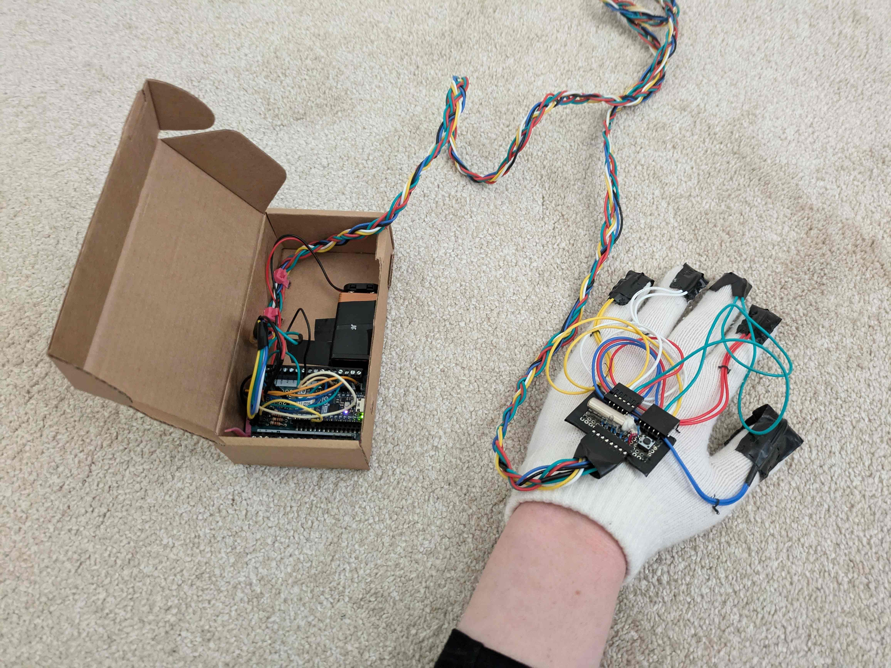

# PAWBOARD

https://github.com/lilygorsheneva/paw-board

A chorded keyboard using pressure sensitive resistors and bluetooth. Embedded software isn't my usual work but I thought this would be fun. 

## Features (Complete)

* Upper and lower-case english letter entry along with a few control characters; sufficient for chatting but not much more. 

* Wireless connectivity with passkey entry for MITM protection. 
> Note: The bluetooth functionality depends heavily on Expressif's example code, and I cannot vouch for the security of it or the BT libraries themselves. Device not recommended for a secure context.

* Haptic feedback.

## Features (planned)

* Layout switching (numerical input is actually supported right now but is only used during passkey entry).

* Automatic calibration (studying digital signal processing so I can get rid of the pushbutton).

## Hardware 

* Arduino Nano ESP32 (I tried other Arduinos but they don't support simultaneously using both Wireless functionality and all their ADC pins).

* Force sensing resistors
    * currently using DIY ones I made out of Velostat (an antistatic material whose resistivity is pressure-sensitive; easily obtained from diy electronics suppliers e.g. Adafruit)
    * I've tried [these](https://www.digikey.com/en/products/detail/ohmite/FSR05BE/10127621) force sensing resistors made by Ohmite but found mounting them and properly aligning them with my fingertips to be tricky. 

* Vibrator motor (for feedback).

